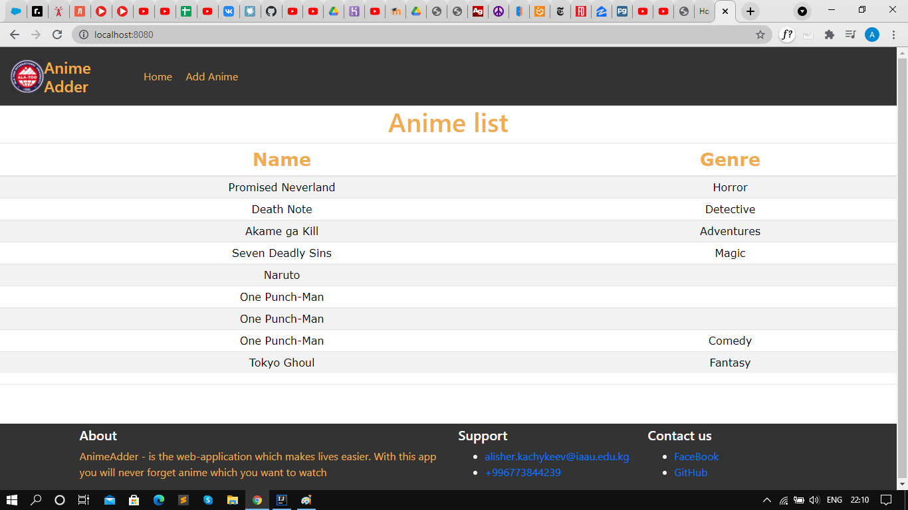
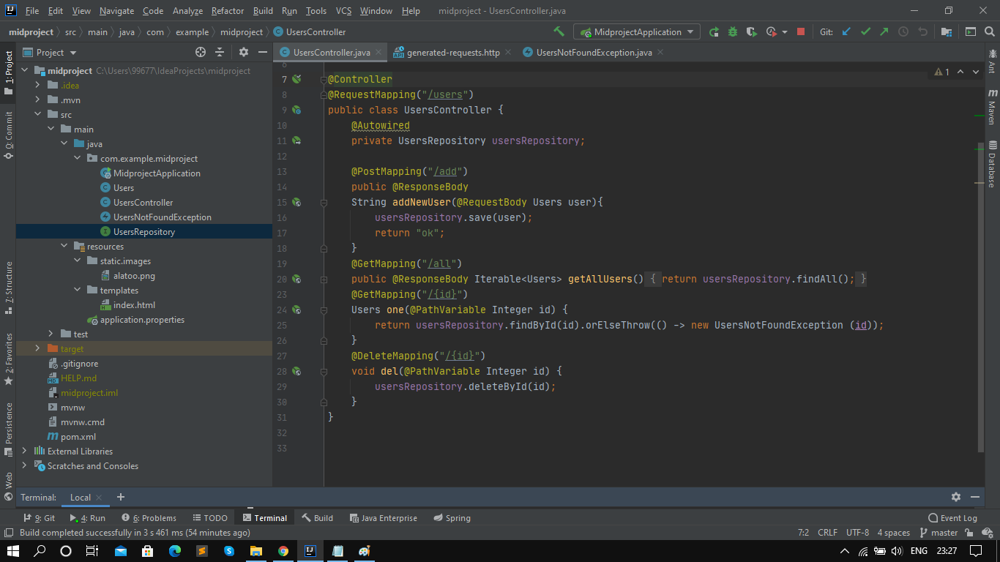
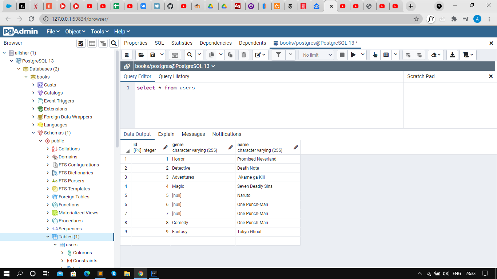

# Project description
It is simple web-application, which can help people who watchs anime, with this app you can easy remember anime you want to watch. Done with love.

## Heroku Link
* https://mid21dbase.herokuapp.com/

## Team
Alisher Kachykeev com 19

## What i use
* PostgreSQL
* Bootstrap
* Spring
* Thymeleaf
* Rest API

## API Description
* To access data by REST API entry point is /users
* To see all anime you should access /users/all
* To add anime you should do a POST request to /users/add
* To get anime id you should do GET request to /users/{id}
* To delete anime id you should do DELETE request to /users/{id}
Here you can see API

## PostgreSQL
* Here i want to show you connection, all datas from web-app goes to postgreSQL

